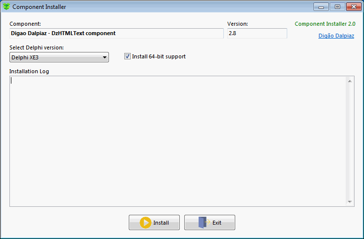

# Component Installer

## Delphi VCL app utility to auto-install component packages into IDE.

- [What's New](#whats-new)
- [Description](#description)
- [Features](#features)
- [How to use](#how-to-use)
- [CompInstall.ini structure](#compinstallini-structure)

## What's New

- 12/18/2020 (Version 2.2)

   - Fixed call to rsvars.bat when Delphi is installed in a path containing spaces characters.

- 10/31/2020 (Version 2.1)

   - Included Delphi 10.4 Sydney support.
   - Implemented verification of the 64-bit Delphi compiler existence when the 64-bit flag was set.

- 10/26/2020 (Version 2.0)

   - Compilation process now uses thread.
   - GitHub auto-update supporting.

- 05/03/2020 (Version 1.2)

   - Fixed RegisterBPL method because Delphi XE5 or below use "RAD Studio" public folder instead "Embarcadero\Studio".

- 02/15/2019 (Version 1.1)

   - Removed Allow64bit parameter in the General section. The app will detect this parameter automatically when appears at any package parameter.

## Description

This app allows you to distribute your Delphi component without having to do a long task list to manually install the component into IDE (*when you are providing component sources, of course*).

In addition, if the component is hosted on GitHub, you can indicate the path of the repository and the application will check for updates directly in the repository's Releases.

## Features

- Detects all Delphi versions installed and allows programmer to choose which IDE to install.
- Compiles packages generating BPL files.
- Installs packages into IDE.
- Registers paths into Library Path.
- Copies required resource files to compiled folder (.dfm, .res, ...).
- Updates component hosted at GitHub automatically.
- Supports 32 bits and 64 bits compilation.

## How to use

You need only to create an Ini file called **CompInstall.ini** and write parameters to the app.

Then put the **CompInstall.exe** and **CompInstall.ini** into your component package directory and be happy. :wink:

> Note: This app requires MSBUILD, which is present at .NET Framework 2.0, 3.5 and 4.0. When the app launch, it will verify if any MSBUILD is available.

## CompInstall.ini structure

**`[General]` section**

`Name` (required) = Component name displayed at install form and registered into Delphi Packages.

`Version` (required) = Component version displayed at install form and used by GitHub auto-update control (if enabled).

`DelphiVersions` (required) = It's a list splited by ";" with all Delphi versions supported by the component. According to Delphi versions installed in Windows and combining with this parameter, a combobox in the install form will list all possible Delphi versions.

> Supported values: 2005;2006;2007;2009;2010;XE;XE2;XE3;XE4;XE5;XE6;XE7;XE8;10;10.1;10.2;10.3;10.4

`Packages` (required) = It's a list splited by ";" with packages to be compiled, in correct order. Just type the package name without the file extension.

`AddLibrary` (optional) = 0 or 1. When 1, the path of release folders of component will be registered into Delphi library path.

**Package section**

To specify package parameters, create a section with the name of the package with the `P_` prefix, like:

`[P_MyPackage]`

`Allow64bit` (optional) = 0 or 1. When 1, specify this package to be compiled twice, with 32-bit and 64-bit versions. Remember to create this platform at Delphi Project Manager, otherwise the 64-bit compilation will fail.

If any package has this option enabled, it will be display a checkbox allowing install 64-bit version of component (the checkbox starts checked by default).

`PublishFiles` (optional) = It's a list splited by ";" with all files you want to copy into release folders (usually DFM form files used at runtime and resource files).

`Install` (optional) = 0 or 1. When 1, this package will be installed into Delphi IDE. You need to set this option for design-time packages when you want to register components into Delphi IDE.

>Note: The app compiles your component using **Release** target. This means all packages need to be configured at default output folder (Win32\Release and Win64\Release).

**GitHub section**

`Repository` (optional) = Allows you to specify a GitHub repository (syntax: `GitHub account`/`Repository name`), so when app starts, it will check for component update using GitHub API, reading the latest existing release and comparing its version with current version. If the versions don't match, a dialog will be displayed asking if you want to auto-update files.

### Example

In this example, there are two Delphi packages (DamPackage and DamDesignPackage). The design-time package (DamDesignPackage) is configured to install into Delphi IDE. The runtime package (DamPackage) is configured to copy dfm form file and resource file to release folder.

```
[General]
Name=Dam Component
Version=1.0
DelphiVersions=XE2;XE3;XE4;XE5;XE6;XE7;XE8;10;10.1;10.2;10.3;10.4
Packages=DamPackage;DamDesignPackage
AddLibrary=1

[P_DamPackage]
Allow64bit=1
PublishFiles=DamDialog.dfm;Dam_Resource.res

[P_DamDesignPackage]
Install=1
```

**Check my Delphi components here at GitHub and find CompInstall.ini file to see others usage examples.**
