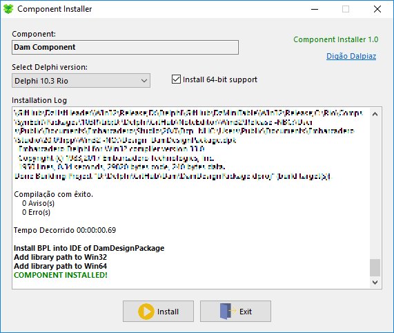

# Component Installer

## Delphi app utility to auto-install component packages into IDE.

This app allows you to distribute your Delphi component without having to do a long task list to manually install the component into IDE.

You need only to create a Ini file called CompInstall.ini and write parameters to the app.

Then put the CompInstall.exe and CompInstall.ini into your component package directory and be happy.

## CompInstall.ini structure

**`[General]` section**

`Name` (required) = Component name displayed at install form and registered into Delphi Packages.

`Allow64bit` (optional) = 0 or 1. When 1, it will be display a checkbox allowing install 64-bit version of component (the checkbox starts checked by default).

`DelphiVersions` (required) = It's a list splited by ";" with all Delphi versions supported by the component. According to Delphi versions installed in Windows and combining with this parameter, a combobox in the install form will list all possible Delphi versions.

> Supported values: 2005;2006;2007;2009;2010;XE;XE2;XE3;XE4;XE5;XE6;XE7;XE8;10;10.1;10.2;10.3

`Packages` (required) = It's a list splited by ";" with packages to be compiled, in correct order. Just type the package name without the file extension.

`AddLibrary` (optional) = 0 or 1. When 1, the path of release folders of component will be registered into Delphi library path.

**Package section**

To specify package parameters, create a section with the name of the package with the `P_` prefix, like:

`[P_MyPackage]`

`Allow64bit` (optional) = 0 or 1. When 1, specify this package to be compiled twice, with 32-bit and 64-bit versions. Remember to create this platform at Delphi Project Manager, otherwise the 64-bit compilation will fail.

This option needs the General section `Allow64bit` enabled!

`PublishFiles` (optional) = It's a list splited by ";" with all files you want to copy into release foldes (usually DFM form files used at runtime and resource files).

`Install` (optional) = 0 or 1. When 1, this package will be installed into Delphi IDE. You need to set this option for design-time packages when you want to register components into Delphi IDE.
